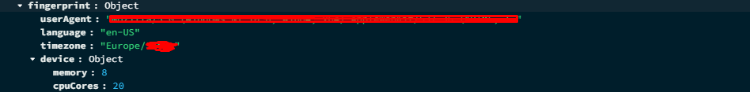

# PvP-Scalpel-backend

This API manages the database and delivers data to the front-end.

## REST API Routes

All endpoints return data in JSON format.

---

### GET `/member/list`

Returns an array of objects containing guild member data.

#### Each player object includes:
- name
- realm
- server
- guild data
- character media

Sorted by guild rank (lower number = higher rank).

---

### PATCH `/member/patch`

Updates the API's local database with member data and ranks retrieved from the Blizzard API.

Returns an array of updated member objects, sorted by guild rank.

---

### GET `/LDB/2v2`, `/LDB/3v3`, `/LDB/solo`, `/LDB/blitz`, `/LDB/BG`

Returns an array of objects sorted by rating for the requested bracket.

#### Each object contains:
- name
- realm
- server
- race
- class
- active player spec
- rating (for the bracket)
- achievements (for the bracket)
- character media

---

### GET `/checkCharacter/:server/:realm/:name`

#### Dynamic params:
- `server`: Player's server name
- `realm`: Realm slug in kebab-case (e.g. `burning-blade`)
- `name`: Player's name

#### Response:

**200 OK**
```json
{
  "_id": "string",
  "blizID": number,
  "name": "string",
  "realm": { ... },
  "level": number,
  "faction": "string",
  "class": { ... },
  "activeSpec": { ... },
  "rating": { ... },
  "achieves": { ... },
  "media": { ... },
  "checkedCount": number,
  "server": "string",
  "gear": { ... },
  "lastLogin": number,
  "equipmentStats": { ... },
  "likes": [],
  "guildMember": true,
  "guildInsight": { ... },
  "posts": []
}
```

**404 Not Found**
```json
{ "message": "No character with these credentials (bad parameters)" }
```

**500 Server Error**
```json
{ "message": "Error retrieving the data" }
```

---

### PATCH `/patchCharacter/:server/:realm/:name`

#### Logic:
Fetches and stores fresh data from the Blizzard API.

Returns the same object as the `GET /checkCharacter/:server/:realm/:name` route.

---

### PATCH `/patchPvPData/:server/:realm/:name`

#### Logic:
Fetches and stores fresh PvP data from the Blizzard API.

Returns the full updated character object, same as `GET /checkCharacter`.

---

## Authentication / Session Routes

### 🔐 Privacy & Session Tracking Disclaimer

This application tracks user sessions for authentication, security, and account protection purposes.

The following information may be collected during login:
- Browser type and version
- Operating system platform
- Language and timezone
- Device memory and CPU information

This data may be temporarily stored and used to:
- Detect suspicious login attempts
- Manage active sessions across devices
- Improve security through browser fingerprinting

**Note**: This data is not used for advertising and is never shared with third parties.

By using this application, you agree to this usage for security and session management purposes.

---

### POST `/login`

#### Expected JSON body:
- `email`: String
- `password`: String (plaintext)
- `fingerprint`: Object (see example image below)


