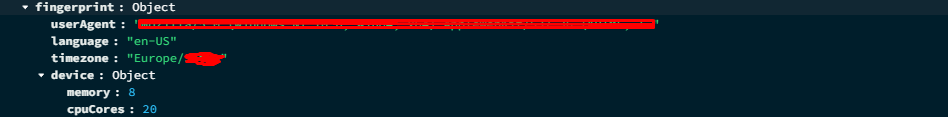

# PvP-Scalpel-backend
This API controls the database and sends requested data to the front-end.

REST API routes

The api returns only JSON format

At GET /member/list

    return Array of OBJECTS that hold guild members with data:

        player:

            name
            realm
            server
            guild data 
            character media

    sorted by guild rank higher is better

At PATCH /member/patch

    return array of OBJECTS from the Blizzard API containing the members and ranks ( number e.g 0, 1, 2 higher is better)
    and updating the API's local databases with the members and their ranks

AT GET routes : /LDB/2v2, /LDB/3v3, /LDB/solo, /LDB/blitz, /LDB/BG

        returns Aray of Objects sorted by RATING in the current bracket E.G for /LDB/3v3 will return JSON 
        for the bracket 3 V 3 end so on..

        the Objects will contain:

            name
            realm
            server
            race
            class
            active player spec
            rating ( for the requested bracket )
            achieves ( for the requested bracket )
            character media
        
At GET route : /checkCharacter/:server/:realm/:name

    where the dinamic params are:

        server ( player server )
        realm ( player realm slugified kebab-case )
        name ( player name )

    return:

        STATUS:

            200:

                Object:

                    _id : String
                    blizID : Number
                    name : String
                    realm : Object
                    level : Number
                    faction : String
                    class : Object
                    activeSpec : Object
                    rating : Object
                    achieves : Object
                    media : Object
                    checkedCount : Number ( the number of times the character has been checked )
                    server : String
                    gear : Object
                    lastLogin : Number
                    equipmentStats : Object
                    likes : Array
                    guildMember : Boolean
                    guildInsight: Object
                    posts : Array

            404:
            
                return:
                
                    Object
                        messege: No character with this credentials ( bad parameters )

            500:

                return:

                    Object
                    messege: Error retrieveing the data

At PATCH route : /patchCharacter/:server/:realm/:name

    where the dinamic params are:

        server ( player server )
        realm ( player realm slugified kebab-case )
        name ( player name )

    Logic:

        Retrive store and return the fresh data from the Blizzard API

    return: SAME AS GET route : /checkCharacter/:server/:realm/:name

At PATCH route: /patchPvPData/:server/:realm/:name

    where the dinamic params are:

        server ( player server )
        realm ( player realm slugified kebab-case )
        name ( player name )

    Logic:

        Retrive and store the fresh PVP data from the Blizzard API then return the whole character data

    return: SAME AS GET route : /checkCharacter/:server/:realm/:name

Authentication / session related routes

## 🔐 Privacy & Session Tracking Disclaimer

This application tracks user sessions for authentication, security, and account protection purposes.

I (the author) collect basic device and browser information during login, including:
- Browser type and version
- Operating system platform
- Language and timezone
- Device memory and CPU information

This information may be stored temporarily and used to:
- Detect suspicious login attempts
- Help users manage active sessions across devices
- Improve security through browser fingerprinting

I (the author) do **not** use this data for advertising or tracking users outside of this platform. Data is handled securely and is not shared with third parties.

By using this application, you consent to this usage for session and security management.

At POST route : /login

    